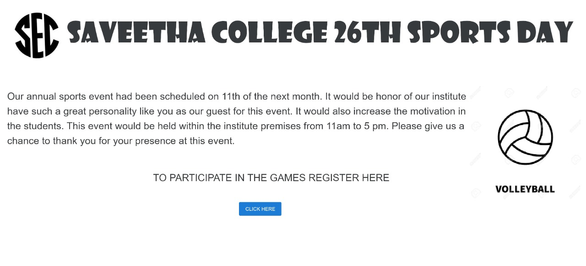
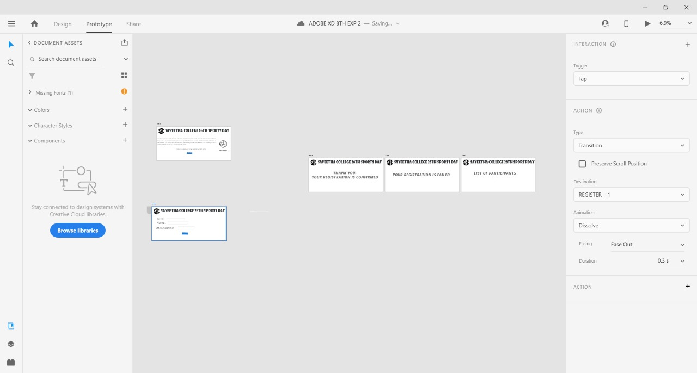

# WebApplication for Event Registration

## AIM:
To create a UX design and develop a web application for event registration.
## DESIGN STEPS:
### Step 1: 
Requirement collection.
### Step 2:
Choosing the suitable color scheme
### Step 3: 
Creating artboards for individual pages
### Step 4:
Designing layout for individual pages
### Step 5:
Creating links and linking it with artboards
### Step 6:
Preview the prototype.


## DESIGN SCREENS:





## WIREFRAME:


## PROTOTYPE:



## PROGRAM:
### home.html
```
<!doctype html>
<html lang="en">

<head>
    <!-- Required meta tags -->
    <meta charset="utf-8">
    <meta name="viewport" content="width=device-width, initial-scale=1, shrink-to-fit=no">

    <!-- Bootstrap CSS -->
    <link rel="stylesheet" href="https://maxcdn.bootstrapcdn.com/bootstrap/4.0.0/css/bootstrap.min.css"
        integrity="sha384-Gn5384xqQ1aoWXA+058RXPxPg6fy4IWvTNh0E263XmFcJlSAwiGgFAW/dAiS6JXm" crossorigin="anonymous">

    <title>Hello, Students!</title>
</head>

<body>
    <div class="jumbotron" style="box-sizing: border-box;">
        <div class="p-5 text-center bg-image" style="
      background-image: url('https://dubeat.com/wp-content/uploads/cultural-fests.jpg');
      height: 200%;background-repeat: no-repeat;background-size: cover;">


            <div class="container  text-center">
                
                <h1>saveetha engineering college</h1>
                <h1 class="text-right">Anual culturals week</h1>
                <h1 class="text-right">venue:saveetha engineering college</h1>
                <h1 class="text-right">Time:9am-5pm</h1>
                <h1 class="text-right">date:2.4.2021-9.4.2021</h1>


                <div class="container text-right">
                    <div class="row">
                        <div class="card col-12 col-md-6 col-lg-4">
                            
                        </div>
                        <div class="card col-12 col-md-6 col-lg-4">
                            
                        </div>
                        <div class="card col-12 col-md-6 col-lg-4">
                            
                        </div>

                    </div>
                </div>

            </div>
        </div>
    </div>
    <div class="container">
        <div class="row">
            <div class="col-12">
                <h1>Culturals registration</h1>

            </div>
        </div>
    </div>
    <div class="container">
        <div class="row">
            <div class="col-12">
                <a href="/registration" class="btn btn-primary btn-lg active" role="button"
                    aria-pressed="true">Register</a>
            </div>
        </div>
    </div>


    <!-- Optional JavaScript -->
    <!-- jQuery first, then Popper.js, then Bootstrap JS -->
    <script src="https://code.jquery.com/jquery-3.2.1.slim.min.js"
        integrity="sha384-KJ3o2DKtIkvYIK3UENzmM7KCkRr/rE9/Qpg6aAZGJwFDMVNA/GpGFF93hXpG5KkN"
        crossorigin="anonymous"></script>
    <script src="https://cdnjs.cloudflare.com/ajax/libs/popper.js/1.12.9/umd/popper.min.js"
        integrity="sha384-ApNbgh9B+Y1QKtv3Rn7W3mgPxhU9K/ScQsAP7hUibX39j7fakFPskvXusvfa0b4Q"
        crossorigin="anonymous"></script>
    <script src="https://maxcdn.bootstrapcdn.com/bootstrap/4.0.0/js/bootstrap.min.js"
        integrity="sha384-JZR6Spejh4U02d8jOt6vLEHfe/JQGiRRSQQxSfFWpi1MquVdAyjUar5+76PVCmYl"
        crossorigin="anonymous"></script>
</body>

</html>
```

### registration.html

```
<!doctype html>
<html lang="en">

<head>
    <!-- Required meta tags -->
    <meta charset="utf-8">
    <meta name="viewport" content="width=device-width, initial-scale=1, shrink-to-fit=no">

    <!-- Bootstrap CSS -->
    <link rel="stylesheet" href="https://maxcdn.bootstrapcdn.com/bootstrap/4.0.0/css/bootstrap.min.css"
        integrity="sha384-Gn5384xqQ1aoWXA+058RXPxPg6fy4IWvTNh0E263XmFcJlSAwiGgFAW/dAiS6JXm" crossorigin="anonymous">

    <title>Saveetha Engineering College</title>
</head>

<body>
    <div class="jumbotron" style="box-sizing: border-box;">
        <div class="p-5 text-center bg-image" style="
      background-image: url('https://dubeat.com/wp-content/uploads/cultural-fests.jpg');
      height: 200%;background-repeat: no-repeat;background-size: cover;">
            <div class="container">


                <div class="container  text-center">

                    
                    <h1>saveetha engineering college</h1>
                    <h1 class="display-4">Hello, students!</h1>
                    <h1 class="display-4">Welcome to our cultural program</h1>
                </div>
            </div>


            <div class="container">
                <div class="row">
                    <div class="col-12">
                        <h1>Application</h1>
                        <form method="POST" action="/registration/">
                            


                            <div class="form-group">
                                <label for="exampleInputEmail1">NAME:</label>
                                <input type="name" class="form-control" id="name" aria-describedby="emailHelp"
                                    placeholder="Enter name">
                            </div>
                            <div class="form-group">
                                <label for="exampleInputPassword1">EMAIL:</label>
                                <input type="email" class="form-control" id="exampleInputPassword1" placeholder="Email">
                                <small id="emailHelp" class="form-text text-muted">We'll never share your details with
                                    anyone else.</small>
                            </div>
                            <div class="form-group">
                                <label for="exampleInputPassword1">PHONE NO. :</label>
                                <input type="number" class="form-control" id="exampleInputPassword1"
                                    placeholder="Phone number">
                            </div>

                            <div class="container">
                                <div class="row">
                                    <div class="col-12">
                                        <a href="/succes" class="btn btn-primary btn-lg active" role="button"
                                            aria-pressed="true">Submit</a>
                                    </div>
                                </div>
                            </div>
                        </form>


                    </div>
                </div>
            </div>


            <!-- Optional JavaScript -->
            <!-- jQuery first, then Popper.js, then Bootstrap JS -->
            <script src="https://code.jquery.com/jquery-3.2.1.slim.min.js"
                integrity="sha384-KJ3o2DKtIkvYIK3UENzmM7KCkRr/rE9/Qpg6aAZGJwFDMVNA/GpGFF93hXpG5KkN"
                crossorigin="anonymous"></script>
            <script src="https://cdnjs.cloudflare.com/ajax/libs/popper.js/1.12.9/umd/popper.min.js"
                integrity="sha384-ApNbgh9B+Y1QKtv3Rn7W3mgPxhU9K/ScQsAP7hUibX39j7fakFPskvXusvfa0b4Q"
                crossorigin="anonymous"></script>
            <script src="https://maxcdn.bootstrapcdn.com/bootstrap/4.0.0/js/bootstrap.min.js"
                integrity="sha384-JZR6Spejh4U02d8jOt6vLEHfe/JQGiRRSQQxSfFWpi1MquVdAyjUar5+76PVCmYl"
                crossorigin="anonymous"></script>
        </div>
</body>

</html>
```

### succes.html
```
<!doctype html>
<html lang="en">

<head>
    <!-- Required meta tags -->
    <meta charset="utf-8">
    <meta name="viewport" content="width=device-width, initial-scale=1, shrink-to-fit=no">

    <!-- Bootstrap CSS -->
    <link rel="stylesheet" href="https://maxcdn.bootstrapcdn.com/bootstrap/4.0.0/css/bootstrap.min.css"
        integrity="sha384-Gn5384xqQ1aoWXA+058RXPxPg6fy4IWvTNh0E263XmFcJlSAwiGgFAW/dAiS6JXm" crossorigin="anonymous">

    <title>Saveetha Engineering College</title>
</head>

<body>
     <div class="jumbotron" style="box-sizing: border-box;">
      <div class="p-5 text-center bg-image" style="
      background-image: url('https://dubeat.com/wp-content/uploads/cultural-fests.jpg');
      height: 200%;background-repeat: no-repeat;background-size: cover;">
    
            <h1 class="display-4">Anuual Culturals</h1>
            <p class="lead">A week for brining out your talent and show it to the world </p>
            <hr class="my-4">
             <div class="container">

     <div class="row">
            <div class="col-12">

                <h1>Congragulations!You're in.</h1>
                <p class="lead">We hope you have fun. Thank You and Have a great day.
            
            <a href="/home/" class="btn btn-primary btn-lg active" role="button" aria-pressed="true">Home</a>
    </div>

                <!-- Optional JavaScript -->
                <!-- jQuery first, then Popper.js, then Bootstrap JS -->
                <script src="https://code.jquery.com/jquery-3.2.1.slim.min.js"
                    integrity="sha384-KJ3o2DKtIkvYIK3UENzmM7KCkRr/rE9/Qpg6aAZGJwFDMVNA/GpGFF93hXpG5KkN"
                    crossorigin="anonymous"></script>
                <script src="https://cdnjs.cloudflare.com/ajax/libs/popper.js/1.12.9/umd/popper.min.js"
                    integrity="sha384-ApNbgh9B+Y1QKtv3Rn7W3mgPxhU9K/ScQsAP7hUibX39j7fakFPskvXusvfa0b4Q"
                    crossorigin="anonymous"></script>
                <script src="https://maxcdn.bootstrapcdn.com/bootstrap/4.0.0/js/bootstrap.min.js"
                    integrity="sha384-JZR6Spejh4U02d8jOt6vLEHfe/JQGiRRSQQxSfFWpi1MquVdAyjUar5+76PVCmYl"
                    crossorigin="anonymous"></script>
</body>

</html>
```
### failed.html

```
<!doctype html>
<html lang="en">

<head>
    <!-- Required meta tags -->
    <meta charset="utf-8">
    <meta name="viewport" content="width=device-width, initial-scale=1, shrink-to-fit=no">

    <!-- Bootstrap CSS -->
    <link rel="stylesheet" href="https://maxcdn.bootstrapcdn.com/bootstrap/4.0.0/css/bootstrap.min.css"
        integrity="sha384-Gn5384xqQ1aoWXA+058RXPxPg6fy4IWvTNh0E263XmFcJlSAwiGgFAW/dAiS6JXm" crossorigin="anonymous">

    <title>Saveetha Engineering College</title>
</head>

<body>
    <div class="jumbotron" style="box-sizing: border-box;">
    <div class="p-5 text-center bg-image" style="
      background-image: url('https://dubeat.com/wp-content/uploads/cultural-fests.jpg');
      height: 200%;background-repeat: no-repeat;background-size: cover;">
    <div class="jumbotron">
        <div class="container">
            <h1 class="display-4">Annual Cultural Day</h1>
            <p class="lead"></p>
           
        </div>
    </div>

    <div class="container">
        <div class="row">
            <div class="col-12">

                <h1>Sorry!</h1>
                <p class="lead">Seats are filled. Try again next time.Have a good day.

                </p>
    <a href="/home/" class="btn btn-primary btn-lg active" role="button" aria-pressed="true">Home</a>
    </div>

    <!-- Optional JavaScript -->
    <!-- jQuery first, then Popper.js, then Bootstrap JS -->
    <script src="https://code.jquery.com/jquery-3.2.1.slim.min.js"
        integrity="sha384-KJ3o2DKtIkvYIK3UENzmM7KCkRr/rE9/Qpg6aAZGJwFDMVNA/GpGFF93hXpG5KkN"
        crossorigin="anonymous"></script>
    <script src="https://cdnjs.cloudflare.com/ajax/libs/popper.js/1.12.9/umd/popper.min.js"
        integrity="sha384-ApNbgh9B+Y1QKtv3Rn7W3mgPxhU9K/ScQsAP7hUibX39j7fakFPskvXusvfa0b4Q"
        crossorigin="anonymous"></script>
    <script src="https://maxcdn.bootstrapcdn.com/bootstrap/4.0.0/js/bootstrap.min.js"
        integrity="sha384-JZR6Spejh4U02d8jOt6vLEHfe/JQGiRRSQQxSfFWpi1MquVdAyjUar5+76PVCmYl"
        crossorigin="anonymous"></script>
</body>

</html>
```

### list of participants.html
```
<!doctype html>
<html lang="en">

<head>
    <!-- Required meta tags -->
    <meta charset="utf-8">
    <meta name="viewport" content="width=device-width, initial-scale=1, shrink-to-fit=no">

    <!-- Bootstrap CSS -->
    <link rel="stylesheet" href="https://maxcdn.bootstrapcdn.com/bootstrap/4.0.0/css/bootstrap.min.css"
        integrity="sha384-Gn5384xqQ1aoWXA+058RXPxPg6fy4IWvTNh0E263XmFcJlSAwiGgFAW/dAiS6JXm" crossorigin="anonymous">

    <title>Saveetha Engineering College</title>
</head>

<body>
     <div class="jumbotron" style="box-sizing: border-box;">
      <div class="p-5 text-center bg-image" style="
      background-image: url('https://dubeat.com/wp-content/uploads/cultural-fests.jpg');
      height: 200%;background-repeat: no-repeat;background-size: cover;">
        <div class="container">
      
      
        <div class="container  text-center">
            
            
            <h1>saveetha engineering college</h1>
            <h1 class="display-4">Hello, students!</h1>
            <h1 class="display-4">Welcome to our cultural program</h1>
        </div>
      </div>
            
        <div class="row">
            <div class="col-12">
                <h1>Congragulations!</h1>
            </div>
        </div>
        <div class="row">
            <div class="col-12">
                <table class="table">
                    <thead>
                        <tr>
                            <th scope="col">NAME</th>
                            <th scope="col">EMAIL</th>
                            <th scope="col">PHONE</th>
                           
                        </tr>
                    </thead>
                    <tbody>

                        <tr>
                            <td>kamal</td>
                            <td>raja@gmail.com</td>
                            <td>234242</td>
                            
                        </tr>

                        <tr>
                            <td>Ram</td>
                            <td>ram@gmail.com</td>
                            <td>9876234242</td>
                            
                        </tr>

                        <tr>
                            <td>Ramesh</td>
                            <td>ramesh@gmail.com</td>
                            <td>9987764123</td>
                            
                        </tr>

                        <tr>
                            <td>kala</td>
                            <td>kala@gmail.com</td>
                            <td>9988734234</td>
                            
                        </tr>

                        <tr>
                            <td>Sumesh</td>
                            <td>sumes@gmail.com</td>
                            <td>6722337234</td>
                            
                        </tr>

                        <tr>
                            <td>Dhayanitha</td>
                            <td>dhayanitha@gmail.com</td>
                            <td>9088654456</td>
                            
                        </tr>

                        <tr>
                            <td>Vanisha</td>
                            <td>vanisha@gmail.com</td>
                            <td>7885366336</td>
                            
                        </tr>

                        <tr>
                         <td>Moorthy</td>
                            <td>moorthy@gmail.com</td>
                            <td>7888966336</td>  
                            
                        </tr>

                        <tr>
                         <td>Lisha</td>
                            <td>lisha@gmail.com</td>
                            <td>9985366336</td>
                        </tr>

                        <tr>
                           <td>Sanjay</td>
                            <td>sanjay@gmail.com</td>
                            <td>7886739336</td>
                        </tr>

                        <tr>
                           <td>Pradapth</td>
                            <td>pradapth@gmail.com</td>
                            <td>788537886</td>
                        </tr>

                        <tr>
                            <td>Pradeep</td>
                            <td>pradeep@gmail.com</td>
                            <td>8977566336</td>
                        </tr>

                        <tr>
                            <td>Arjun</td>
                            <td>arjun@gmail.com</td>
                            <td>9888766336</td>
                        </tr>

                        <tr>
                            <td>Arun</td>
                            <td>arun@gmail.com</td>
                            <td>9087533232</td>
                        </tr>

                    </tbody>
                </table>
            </div>
        </div>
        <div class="row">
            <div class="col-12 text-center">
                <a href="/home/" class="btn btn-primary btn-lg" role="button">Home</a>
            </div>
        </div>
    </div>

    <!-- Optional JavaScript -->
    <!-- jQuery first, then Popper.js, then Bootstrap JS -->
    <script src="https://code.jquery.com/jquery-3.2.1.slim.min.js"
        integrity="sha384-KJ3o2DKtIkvYIK3UENzmM7KCkRr/rE9/Qpg6aAZGJwFDMVNA/GpGFF93hXpG5KkN"
        crossorigin="anonymous"></script>
    <script src="https://cdnjs.cloudflare.com/ajax/libs/popper.js/1.12.9/umd/popper.min.js"
        integrity="sha384-ApNbgh9B+Y1QKtv3Rn7W3mgPxhU9K/ScQsAP7hUibX39j7fakFPskvXusvfa0b4Q"
        crossorigin="anonymous"></script>
    <script src="https://maxcdn.bootstrapcdn.com/bootstrap/4.0.0/js/bootstrap.min.js"
        integrity="sha384-JZR6Spejh4U02d8jOt6vLEHfe/JQGiRRSQQxSfFWpi1MquVdAyjUar5+76PVCmYl"
        crossorigin="anonymous"></script>
</body>

</html>
```


## OUTPUT:


## RESULT:
Thus, a UX design and develop a web application for event registration has been done and the hostred URL http://krishnamoorthy.student.saveetha.in:8000/home.